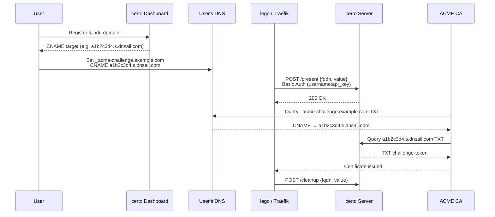

# certo

[中文文档](README_CN.md)

DNS TXT record management server for ACME DNS-01 challenges — speaks both the [lego httpreq](https://go-acme.github.io/lego/dns/httpreq/) and native [acme-dns](https://github.com/acme-dns/acme-dns#api) protocols over the same records, via CNAME delegation.

**Online Service:** [https://dnsall.com](https://dnsall.com) — free to use, no deployment required.

## Features

- **Two challenge protocols, one record** — the lego [httpreq](https://go-acme.github.io/lego/dns/httpreq/) provider (`/present`, `/cleanup`) and the native [acme-dns](https://go-acme.github.io/lego/dns/acme-dns/) protocol (`/register`, `/update`) both drive the same subdomain/TXT/CNAME
- **acme-dns HTTP storage backend** — implements lego's `ACME_DNS_STORAGE_BASE_URL` so an existing account needs no local JSON; stock file-storage + `/register` also works
- **CNAME delegation** — delegate `_acme-challenge` records via CNAME, no need to give CA clients access to your primary DNS
- **Multi-user** — each user gets isolated domains with unique nanoid subdomains
- **API keys with scopes** — global (`*`), wildcard (`*.example.com`) or exact scopes; wildcard/global keys auto-create domains on demand, exact keys are update-only
- **Source-IP allow list** — optional `allowfrom` CIDRs per acme-dns registration restrict who may `/update`
- **Admin API** — `X-Admin-Key` endpoints to manage all users, domains and records
- **Web dashboard** — embedded React SPA (single binary), manage domains, view CNAME/TXT records, copy client config
- **SQLite storage** — local database files without CGO
- **Multi-arch Docker** — `linux/amd64` + `linux/arm64`

## How It Works



## Quick Start

### Docker Compose

```yaml
services:
  certo:
    image: dotns/certo:latest
    restart: unless-stopped
    ports:
      - "53:53"
      - "53:53/udp"
      - "3000:3000"
    volumes:
      - ./data:/app/data
```

Create `data/config.toml`:

```toml
[general]
listen = "0.0.0.0:53"
protocol = "both"
domain = "s.dnsall.com"
nsname = "s.dnsall.com"
nsadmin = "admin.dnsall.com"
records = [
    "s.dnsall.com. A 1.2.3.4",
    "s.dnsall.com. NS s.dnsall.com.",
]

[database]
engine = "sqlite"
connection = "data/db/certo.db"

[api]
api_domain = "api.dnsall.com"
ip = "0.0.0.0"
port = "3000"
tls = "none"
jwt_secret = "change-me-to-a-random-string"
admin_key = "change-me-to-a-secret-key"

[logconfig]
loglevel = "info"
logtype = "stdout"
logformat = "json"
```

```bash
docker compose up -d
```

### Binary

```bash
cd web && npm ci && npx vite build && cd ..   # build the embedded dashboard (web/dist)
CGO_ENABLED=0 go build -o certo .
./certo -c data/config.toml
```

The dashboard is embedded via `//go:embed`, so `web/dist` must exist before `go build`.

## Usage with lego (httpreq)

```bash
LEGO_DISABLE_CNAME_SUPPORT=true \
HTTPREQ_ENDPOINT=https://api.dnsall.com \
HTTPREQ_USERNAME=myuser \
HTTPREQ_PASSWORD=<api_key> \
lego --dns httpreq \
  --dns.propagation-disable-ans \
  --domains example.com \
  --domains "*.example.com" \
  --email admin@example.com \
  --accept-tos run
```

### Traefik

```yaml
# traefik.yml
certificatesResolvers:
  letsencrypt:
    acme:
      email: admin@example.com
      storage: /data/ssl/acme.json
      dnsChallenge:
        provider: httpreq
        propagation:
          disableChecks: true
```

```yaml
# docker-compose.yml
services:
  traefik:
    environment:
      LEGO_DISABLE_CNAME_SUPPORT: "true"
      HTTPREQ_ENDPOINT: "https://api.dnsall.com"
      HTTPREQ_USERNAME: "myuser"
      HTTPREQ_PASSWORD: "<api_key>"
```

## Usage with lego (acme-dns)

certo also speaks the [acme-dns](https://go-acme.github.io/lego/dns/acme-dns/) protocol over the **same** records as httpreq. The acme-dns API is unchanged — `/update` stays on the native root path (`ACME_DNS_API_BASE`). certo additionally implements lego's **HTTP storage backend** (`ACME_DNS_STORAGE_BASE_URL`), which only stores/serves the per-domain account so there is nothing to pre-seed. Point lego at certo with your existing username + API key:

```bash
ACME_DNS_API_BASE=https://api.dnsall.com \
ACME_DNS_STORAGE_BASE_URL=https://myuser:<api_key>@api.dnsall.com/acmedns \
lego --dns acme-dns \
  --domains example.com \
  --domains "*.example.com" \
  --email admin@example.com \
  --accept-tos run
```

lego fetches the account (subdomain + credentials) from the storage URL, then sends every TXT update to the native `POST /update`. The storage URL carries your `username:api_key` (lego's HTTP storage authenticates only via the URL userinfo). The domain is **auto-provisioned on first fetch** (within the key's scope) — no manual domain setup. Set the **same** CNAME as httpreq once: `_acme-challenge.example.com CNAME <cname_target>` (shown in the dashboard). Once the account is saved, updates work with plain file storage and `/update` — no storage URL needed (fully compatible with stock acme-dns).

**Stock acme-dns (local file storage)** also works without any certo account: omit `ACME_DNS_STORAGE_BASE_URL` and use `ACME_DNS_STORAGE_PATH=/path/acme.json`. lego then calls `POST /register`, which anonymously allocates an `acme-<nanoid>` account bound to a random subdomain, saves it to the file, and prints the one-time CNAME — exactly the upstream acme-dns flow.

### Using an existing certo account with acme-dns

An existing account is already a valid acme-dns account — the acme-dns `username`/`password` map to your certo **username**/**API key**, and the `subdomain` is the deterministic one certo already uses. Two ways:

- **HTTP storage (nothing to seed):** just set `ACME_DNS_STORAGE_BASE_URL=https://<username>:<api_key>@<host>/acmedns` (as shown above). lego pulls the account and updates.
- **Local file storage:** pre-seed the JSON with your account, so lego skips `/register` and only calls `/update`:

  ```json
  {
    "example.com": {
      "username": "<your certo username>",
      "password": "<api_key>",
      "fulldomain": "<subdomain>.<base_domain>",
      "subdomain": "<subdomain>",
      "server_url": "https://<host>"
    }
  }
  ```

  Grab the exact object from the dashboard (`cname_target` = `fulldomain`) or with
  `curl -u <username>:<api_key> https://<host>/acmedns/example.com` — it returns the ready-to-paste account.

> **Domain creation follows the API-key scope.** A key auto-creates a not-yet-registered domain on `/present` and on acme-dns storage fetch as long as the domain is within the key's scope — a global key (`*`) for any domain, a scoped key (`*.example.com` or an exact `example.com`) only for the domains it covers. Out-of-scope domains return `403`. Issue a narrowly-scoped key to limit which domains an automation may create.

## API

### Public

| Method | Path | Description |
|--------|------|-------------|
| POST | `/api/register` | Register `{username, password}` → `{token}` |
| POST | `/api/login` | Login `{username, password}` → `{token}` |
| GET | `/api/info` | Server info `{provider, version, base_domain, api_domain, capabilities}` |

### Account & Keys (JWT or global key)

| Method | Path | Description |
|--------|------|-------------|
| GET | `/api/profile` | Get username |
| DELETE | `/api/profile` | Delete account and all data |
| GET | `/api/keys` | List API keys |
| POST | `/api/keys` | Create key `{name, scope}` |
| DELETE | `/api/keys/:id` | Delete key |

### Domains & Records (JWT or any key, scope checked)

| Method | Path | Description |
|--------|------|-------------|
| GET | `/api/domains` | List user's domains |
| POST | `/api/domains` | Add domain `{domain}` |
| DELETE | `/api/domains/:domain` | Remove domain |
| GET | `/api/records` | List user's active TXT records |

### httpreq (Basic Auth: username + api_key)

| Method | Path | Description |
|--------|------|-------------|
| POST | `/present` | Store TXT record `{fqdn, value}` |
| POST | `/cleanup` | Remove TXT record `{fqdn, value}` |

### acme-dns (lego acme-dns provider + HTTP storage)

Credentials are the certo username + API key — basic-auth in the storage URL, headers for update. Domains are auto-provisioned on first storage fetch.

| Method | Path | Description |
|--------|------|-------------|
| POST | `/register` | **Native acme-dns** — anonymously allocate an `acme-<nanoid>` account + random subdomain → `{username, password, fulldomain, subdomain, allowfrom}`. Optional body `{allowfrom:[CIDR…]}` restricts which source IPs may `/update`. |
| POST | `/update` | **Native acme-dns** TXT update `{subdomain, txt}` (headers `X-Api-User`/`X-Api-Key`; `txt` 43 chars; keeps 2 newest) |
| GET | `/acmedns/:domain` | HTTP storage Fetch (get-or-create) → `{username, password, subdomain, fulldomain, server_url}` |
| POST | `/acmedns/:domain` | HTTP storage Put (get-or-create); used by lego's register→save flow |
| GET | `/acmedns` | HTTP storage FetchAll — accounts for the authenticated user, keyed by domain |

### Admin (X-Admin-Key header)

| Method | Path | Description |
|--------|------|-------------|
| GET | `/admin/users` | List all users |
| POST | `/admin/users` | Create user |
| DELETE | `/admin/users/:id` | Delete user and domains |
| GET | `/admin/domains` | List all domains |
| POST | `/admin/domains` | Add domain for user |
| DELETE | `/admin/domains/:domain` | Remove domain |
| GET | `/admin/records` | List all TXT records |

## Configuration

Key settings — see [docs/configuration.md](docs/configuration.md) for every key, its actual
code default, and env overrides.

| Section | Key | Description | Default |
|---------|-----|-------------|---------|
| general | domain | Base domain; records live at `<subdomain>.<domain>` | required |
| general | nsname | Name used in SOA/NS answers | required |
| general | listen | DNS listen address | `:53` when empty |
| general | protocol | `both`, `udp`, `tcp` (+ `4`/`6` variants) | required |
| database | engine | `sqlite` (only supported engine) | `sqlite` |
| database | connection | Local DB path or `file:` URL | required |
| api | ip / port | HTTP listen address; `PORT` env overrides the port | required |
| api | api_domain | API domain (display only) | falls back to `general.domain` |
| api | tls | `none`, `cert`, `letsencrypt`, `letsencryptstaging` | `none` |
| api | jwt_secret | JWT signing key | random per start (sessions drop on restart) |
| api | admin_key | Admin API key | empty (admin API disabled) |

## Documentation

| Document | Contents |
|---|---|
| [docs/architecture.md](docs/architecture.md) | Packages, request flows, DNS resolution, database schema, identifier formats |
| [docs/configuration.md](docs/configuration.md) | Every config key with its real code default |
| [docs/api.md](docs/api.md) | Full HTTP API reference, status codes and error codes |
| [docs/protocols.md](docs/protocols.md) | httpreq and acme-dns client setup, incl. using an existing account |
| [docs/deployment.md](docs/deployment.md) | Docker/binary deployment, DNS delegation, TLS |
| [docs/development.md](docs/development.md) | Build, tests, e2e suite, conventions |

## Development

```bash
just build      # vite build + go build -o dist/certo
just test       # go test ./pkg/...
just lint       # go vet ./... + tsc --noEmit

cd tests/e2e && bun test    # end-to-end suite (real binary + dig)
```

Full details, including the `web/dist` embed requirement, in
[docs/development.md](docs/development.md).

## Acknowledgements

DNS server core based on [acme-dns](https://github.com/acme-dns/acme-dns).

## License

Apache-2.0
