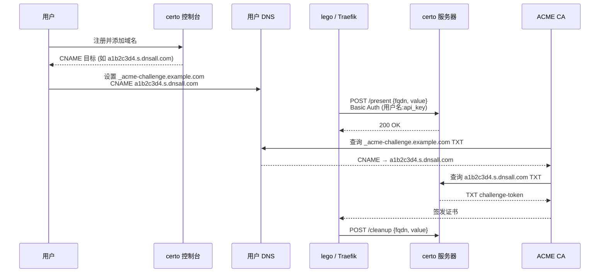

# certo — ACME httpreq 服务器

[English](README.md)

用于 ACME DNS-01 验证的 DNS TXT 记录管理服务器 —— 同时支持 [lego httpreq](https://go-acme.github.io/lego/dns/httpreq/) 与原生 [acme-dns](https://github.com/acme-dns/acme-dns#api) 两种协议，写入同一条记录,通过 CNAME 委派。

**在线服务：** [https://dnsall.com](https://dnsall.com) — 免费使用，无需自行部署。

## 特性

- **两种挑战协议，同一条记录** — lego [httpreq](https://go-acme.github.io/lego/dns/httpreq/)(`/present`、`/cleanup`)与原生 [acme-dns](https://go-acme.github.io/lego/dns/acme-dns/)(`/register`、`/update`)写的是同一个子域/TXT/CNAME
- **acme-dns HTTP 存储后端** — 实现 lego 的 `ACME_DNS_STORAGE_BASE_URL`,已有账号无需本地 JSON;标准文件存储 + `/register` 同样可用
- **CNAME 委派** — 通过 CNAME 委派 `_acme-challenge` 记录，无需将 DNS 主区域权限交给 CA 客户端
- **多用户隔离** — 每个用户的域名分配唯一的 nanoid 子域名，不同用户可独立管理相同域名
- **多级 API Key（带 scope）** — 全局(`*`)、通配(`*.example.com`)、精确 scope;通配/全局 key 可按需自动创建域名,精确 scope 仅更新已有
- **来源 IP 白名单** — acme-dns 注册可带 `allowfrom` CIDR,限制允许 `/update` 的来源
- **管理接口** — `X-Admin-Key` 管理全部用户、域名、记录
- **Web 控制台** — 内嵌 React SPA(单二进制),管理域名、查看 CNAME/TXT、复制客户端配置
- **SQLite 存储** — 纯 Go 无 CGO 的本地数据库文件
- **多架构 Docker** — `linux/amd64` + `linux/arm64`

## 工作原理



## 快速开始

### Docker Compose

```yaml
services:
  certo:
    image: dotns/certo:latest
    restart: unless-stopped
    ports:
      - "53:53"
      - "53:53/udp"
      - "3000:3000"
    volumes:
      - ./data:/app/data
```

创建 `data/config.toml`：

```toml
[general]
listen = "0.0.0.0:53"
protocol = "both"
domain = "s.dnsall.com"
nsname = "s.dnsall.com"
nsadmin = "admin.dnsall.com"
records = [
    "s.dnsall.com. A 1.2.3.4",
    "s.dnsall.com. NS s.dnsall.com.",
]

[database]
engine = "sqlite"
connection = "data/db/certo.db"

[api]
api_domain = "api.dnsall.com"
ip = "0.0.0.0"
port = "3000"
tls = "none"
jwt_secret = "修改为随机字符串"
admin_key = "修改为管理密钥"

[logconfig]
loglevel = "info"
logtype = "stdout"
logformat = "json"
```

```bash
docker compose up -d
```

### 二进制部署

```bash
cd web && npm ci && npx vite build && cd ..   # 构建内嵌的控制台前端(web/dist)
CGO_ENABLED=0 go build -o certo .
./certo -c data/config.toml
```

控制台通过 `//go:embed` 内嵌,因此 `go build` 前 `web/dist` 必须存在。

## 使用方式

### 配合 lego（httpreq）

```bash
LEGO_DISABLE_CNAME_SUPPORT=true \
HTTPREQ_ENDPOINT=https://api.dnsall.com \
HTTPREQ_USERNAME=用户名 \
HTTPREQ_PASSWORD=<api_key> \
lego --dns httpreq \
  --dns.propagation-disable-ans \
  --domains example.com \
  --domains "*.example.com" \
  --email admin@example.com \
  --accept-tos run
```

### 配合 Traefik

```yaml
# traefik.yml
certificatesResolvers:
  letsencrypt:
    acme:
      email: admin@example.com
      storage: /data/ssl/acme.json
      dnsChallenge:
        provider: httpreq
        propagation:
          disableChecks: true
```

```yaml
# docker-compose.yml
services:
  traefik:
    environment:
      LEGO_DISABLE_CNAME_SUPPORT: "true"
      HTTPREQ_ENDPOINT: "https://api.dnsall.com"
      HTTPREQ_USERNAME: "用户名"
      HTTPREQ_PASSWORD: "<api_key>"
```

### 配合 lego（acme-dns）

certo 同时支持 [acme-dns](https://go-acme.github.io/lego/dns/acme-dns/) 协议，写入的是**同一条记录**。acme-dns 协议本身不变 —— `/update` 仍走原生根路径（`ACME_DNS_API_BASE`）。certo 额外实现了 lego 的 **HTTP 存储后端**（`ACME_DNS_STORAGE_BASE_URL`），它只负责保存/下发各域名的账号，因此无需预置。用你已有的用户名 + API Key 指向 certo 即可：

```bash
ACME_DNS_API_BASE=https://api.dnsall.com \
ACME_DNS_STORAGE_BASE_URL=https://用户名:<api_key>@api.dnsall.com/acmedns \
lego --dns acme-dns \
  --domains example.com \
  --domains "*.example.com" \
  --email admin@example.com \
  --accept-tos run
```

lego 从存储 URL 拉取账户（子域 + 凭据），之后每次都把 TXT 发到原生 `POST /update`。存储 URL 里带着你的 `用户名:api_key`(lego 的 HTTP 存储只通过 URL userinfo 鉴权)。**首次拉取自动创建域名**(在 key 的 scope 范围内),无需手动添加。CNAME 与 httpreq 完全相同,设置一次即可:`_acme-challenge.example.com CNAME <cname_target>`(控制台可查看)。账号一旦保存,后续用本地文件存储 + `/update` 即可更新,不再需要存储 URL(完全兼容原生 acme-dns)。

**原生 acme-dns(本地文件存储)** 也可零账号使用:去掉 `ACME_DNS_STORAGE_BASE_URL`,改用 `ACME_DNS_STORAGE_PATH=/path/acme.json`。lego 会调用 `POST /register` 匿名分配一个绑定随机子域的 `acme-<nanoid>` 账号,存进文件并提示一次性 CNAME —— 就是上游 acme-dns 的标准流程。

### 用已有 certo 账号跑 acme-dns

已有账号本身就是合法的 acme-dns 账号 —— acme-dns 的 `username`/`password` 就是你的 certo **用户名**/**API key**,`subdomain` 就是 certo 已在用的确定性子域。两种方式:

- **HTTP 存储(无需预置):** 设 `ACME_DNS_STORAGE_BASE_URL=https://<用户名>:<api_key>@<host>/acmedns`(如上所示),lego 自动拉取账号并更新。
- **本地文件存储:** 把你的账号预置进 JSON,lego 就跳过 `/register`、只调 `/update`:

  ```json
  {
    "example.com": {
      "username": "<你的 certo 用户名>",
      "password": "<api_key>",
      "fulldomain": "<子域>.<base_domain>",
      "subdomain": "<子域>",
      "server_url": "https://<host>"
    }
  }
  ```

  账号对象可从面板(`cname_target` = `fulldomain`)或
  `curl -u <用户名>:<api_key> https://<host>/acmedns/example.com`(直接返回可粘贴的账号)拿到。

> **创建域名遵循 key 的 scope。** 只要域名在 key 的 scope 范围内，`/present` 和 acme-dns 拉取就会自动创建尚未注册的域名 —— 全局 key（`*`）可创建任意域名，受限 key（`*.example.com` 或精确的 `example.com`）只能创建其覆盖的域名。超出 scope 返回 `403`。想限制某个自动化能创建哪些域名，签发对应窄 scope 的 key 即可。

## API

### 公开接口

| 方法 | 路径 | 说明 |
|------|------|------|
| POST | `/api/register` | 注册 `{username, password}` → `{token}` |
| POST | `/api/login` | 登录 `{username, password}` → `{token}` |
| GET | `/api/info` | 服务信息 `{provider, version, base_domain, api_domain, capabilities}` |

### 账户与密钥管理（JWT 或全局 Key）

| 方法 | 路径 | 说明 |
|------|------|------|
| GET | `/api/profile` | 获取用户名 |
| DELETE | `/api/profile` | 删除账户及所有数据 |
| GET | `/api/keys` | 列出 API Key |
| POST | `/api/keys` | 创建 Key `{name, scope}` |
| DELETE | `/api/keys/:id` | 删除 Key |

### 域名与记录（JWT 或任意 Key，按 scope 检查权限）

| 方法 | 路径 | 说明 |
|------|------|------|
| GET | `/api/domains` | 列出域名 |
| POST | `/api/domains` | 添加域名 `{domain}` |
| DELETE | `/api/domains/:domain` | 删除域名 |
| GET | `/api/records` | 列出活跃 TXT 记录 |

### httpreq 协议（Basic Auth：用户名 + api_key）

| 方法 | 路径 | 说明 |
|------|------|------|
| POST | `/present` | 存储 TXT 记录 `{fqdn, value}` |
| POST | `/cleanup` | 删除 TXT 记录 `{fqdn, value}` |

### acme-dns 协议（lego acme-dns provider + HTTP 存储）

凭据为 certo 用户名 + API Key —— 存储接口走 URL 内嵌 Basic Auth，update 走请求头。域名在首次拉取时自动创建。

| 方法 | 路径 | 说明 |
|------|------|------|
| POST | `/register` | **原生 acme-dns** —— 匿名分配 `acme-<nanoid>` 账号 + 随机子域 → `{username, password, fulldomain, subdomain, allowfrom}`。可选 body `{allowfrom:[CIDR…]}` 限制允许 `/update` 的来源 IP。 |
| POST | `/update` | **原生 acme-dns** 写入 TXT `{subdomain, txt}`（请求头 `X-Api-User`/`X-Api-Key`；`txt` 43 字符；保留最新 2 条） |
| GET | `/acmedns/:domain` | HTTP 存储拉取（不存在则创建）→ `{username, password, subdomain, fulldomain, server_url}` |
| POST | `/acmedns/:domain` | HTTP 存储写入（不存在则创建）；用于 lego 的 register→save 流程 |
| GET | `/acmedns` | HTTP 存储 FetchAll —— 当前用户的全部账户，按域名归集 |

### 管理接口（X-Admin-Key 头）

| 方法 | 路径 | 说明 |
|------|------|------|
| GET | `/admin/users` | 列出所有用户 |
| POST | `/admin/users` | 创建用户 |
| DELETE | `/admin/users/:id` | 删除用户 |
| GET | `/admin/domains` | 列出所有域名 |
| POST | `/admin/domains` | 为用户添加域名 |
| DELETE | `/admin/domains/:domain` | 删除域名 |
| GET | `/admin/records` | 列出所有 TXT 记录 |

## 核心概念

### 账户与 API Key

- **账户密码** 仅用于 Web 登录和 Key 丢失后恢复，不用于 API 调用
- **API Key** 用于所有 API 操作（Bearer Token 或 Basic Auth）
- 注册后通过 `GET /api/keys` 获取默认全局 Key

### Key 类型

| 类型 | Scope | 权限 |
|------|-------|------|
| 全局 Key | `["*"]` | 所有域名 + 账户管理 + Key 管理 |
| 范围 Key | `["*.example.com"]` | 仅匹配域名的 present/cleanup/域名管理 |

- 范围 Key 不能访问 `/api/profile`、`/api/keys`
- 范围 Key 只能添加其 scope 覆盖的域名（越界返回 403），添加域名不会改变其 scope
- `*.example.com` 匹配 `example.com` 及所有子域名

### CNAME 委派

每个域名分配一个确定性子域名 `sha256(用户名:域名)[:8]`：

```
_acme-challenge.example.com  CNAME  a1b2c3d4.s.dnsall.com
```

相同用户 + 域名永远生成相同子域名，数据库重建后 CNAME 无需修改。

## 配置项

主要配置项如下,完整清单(含代码级真实默认值、环境变量)见 [docs/configuration.md](docs/configuration.md)。

| 区段 | 键 | 说明 | 默认值 |
|------|-----|------|--------|
| general | domain | 基础域名,记录位于 `<子域>.<domain>` | 必填 |
| general | nsname | SOA/NS 应答中使用的名称 | 必填 |
| general | listen | DNS 监听地址 | 留空为 `:53` |
| general | protocol | `both`、`udp`、`tcp`(可带 `4`/`6` 后缀) | 必填 |
| database | engine | `sqlite`(仅支持此项) | `sqlite` |
| database | connection | 数据库路径或 `file:` URL | 必填 |
| api | ip / port | HTTP 监听地址;`PORT` 环境变量可覆盖端口 | 必填 |
| api | api_domain | API 域名（仅用于展示） | 回退到 `general.domain` |
| api | tls | `none`、`cert`、`letsencrypt`、`letsencryptstaging` | `none` |
| api | jwt_secret | JWT 签名密钥 | 每次启动随机(重启后会话失效) |
| api | admin_key | 管理 API 密钥 | 空（管理 API 禁用） |

## 文档

| 文档 | 内容 |
|---|---|
| [docs/architecture.md](docs/architecture.md) | 包结构、请求流程、DNS 解析、数据库 schema、标识符格式 |
| [docs/configuration.md](docs/configuration.md) | 全部配置项及代码级真实默认值 |
| [docs/api.md](docs/api.md) | 完整 HTTP API 参考、状态码与错误码 |
| [docs/protocols.md](docs/protocols.md) | httpreq 与 acme-dns 客户端配置(含复用已有账号) |
| [docs/deployment.md](docs/deployment.md) | Docker/二进制部署、DNS 委派、TLS |
| [docs/development.md](docs/development.md) | 构建、测试、e2e、开发约定 |

## 开发

```bash
# 安装依赖
cd web && npm install && cd ..

just dev        # 开发模式(前端 + 后端)
just test       # go test ./pkg/...
just lint       # go vet + tsc --noEmit
just build      # 构建(内嵌前端)

cd tests/e2e && bun test   # 端到端测试(真实二进制 + dig)
```

详情(含 `web/dist` 内嵌要求)见 [docs/development.md](docs/development.md)。

## 致谢

DNS 服务器核心基于 [acme-dns](https://github.com/acme-dns/acme-dns)。

## 协议

Apache-2.0
